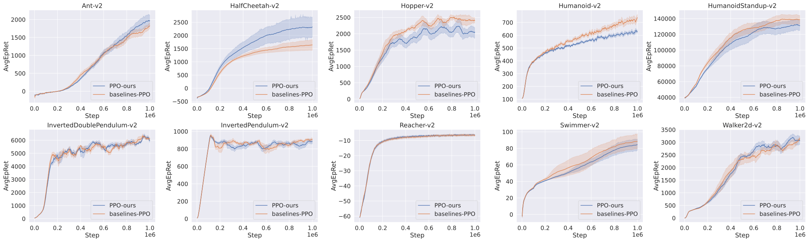

# RL-exercise

## Introduction

Codes are now mainly copyed from

- [google/dopamine](https://github.com/google/dopamine)
- [openai/baselines](https://github.com/openai/baselines)
- [openai/spinningup](https://github.com/openai/spinningup)
- [hill-a/stable-baselines](https://github.com/hill-a/stable-baselines)
- [DLR-RM/stable-baselines3](https://github.com/DLR-RM/stable-baselines3)
- [LQNew/LWDRLC](https://github.com/LQNew/LWDRLC)

The aim is to learn RL and tensorflow1.

## Usage

### Value-based

Arguments:

```c
usage: run_deepq_atari.py [-h] [--dir_name DIR_NAME]
                          [--alg {dqn,clipdqn,ddqn,per,duel,c51}] [--env ENV]
                          [--sticky] [--data_dir DATA_DIR] [--allow_eval]
                          [--save_model] [--total_steps TOTAL_STEPS]

optional arguments:
  -h, --help            show this help message and exit
  --dir_name DIR_NAME   Dir name
  --alg {dqn,clipdqn,ddqn,per,duel,c51}
                        Algorithm name
  --env ENV             Env name
  --sticky              Sticky actions
  --data_dir DATA_DIR   Data disk dir
  --allow_eval          Whether to eval agent
  --save_model          Whether to save model
  --total_steps TOTAL_STEPS
                        Total steps trained
```

Run one experiment:

```c
CUDA_VISIBLE_DEVICES=0 python run_experiment.py --alg dqn
CUDA_VISIBLE_DEVICES=1 python run_experiment.py --sticky --alg c51
```

Run six parallel experiments using script.

```c
zsh run_deepq_atari.py dqn Breakout DQN-test
```

### Deterministic Policy gradient

todo

### Policy gradient

Arguments:

```c
usage: run_pg_mujoco.py [-h] [--dir_name DIR_NAME] [--data_dir DATA_DIR]
                        [--env ENV] [--alg {VPG,TRPO,PPO,PPO2,PPOM}]
                        [--allow_eval] [--save_model]
                        [--total_steps TOTAL_STEPS] [--num_env NUM_ENV]

optional arguments:
  -h, --help            show this help message and exit
  --dir_name DIR_NAME   Dir name
  --data_dir DATA_DIR   Data disk dir
  --env ENV
  --alg {VPG,TRPO,PPO,PPO2,PPOM}
                        Experiment name
  --allow_eval          Whether to eval agent
  --save_model          Whether to save model
  --total_steps TOTAL_STEPS
                        Total steps trained
  --num_env NUM_ENV     Number of envs.
```

Run one experiment:

```c
CUDA_VISIBLE_DEVICES=0 python run_pg_mujoco.py --alg PPO2
CUDA_VISIBLE_DEVICES=1 python run_pg_mujoco.py --alg TRPO --allow_eval
```

Run six parallel experiments using script.

```c
zsh run_pg_mujoco.sh PPO2 Walker2d-v2 PPO-test 1
```

Run six experiments for all envs.

```c
zsh run_pg_mujoco_all.sh PPO2 PPO-test
```

## Training curves

### Mujoco

Average 6 seeds.


